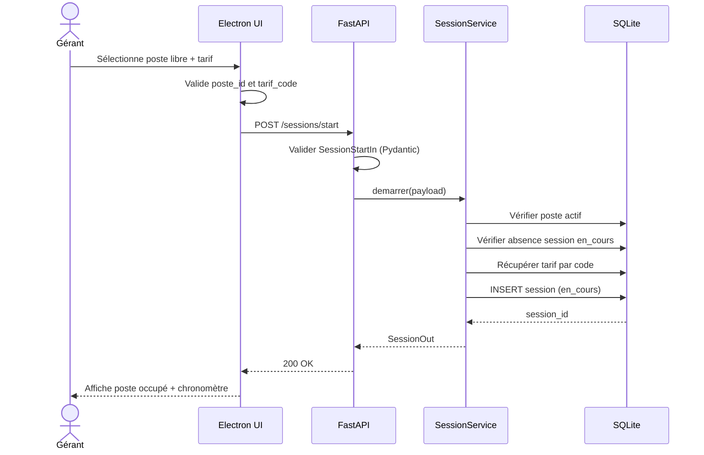
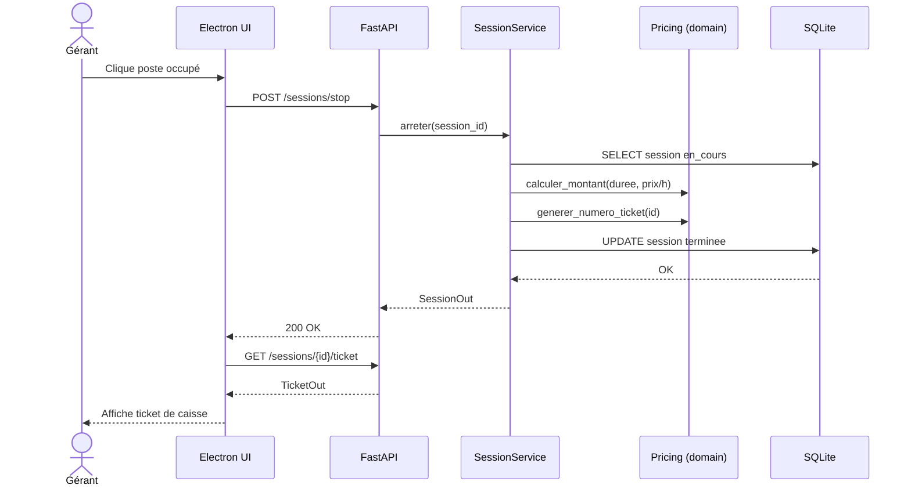
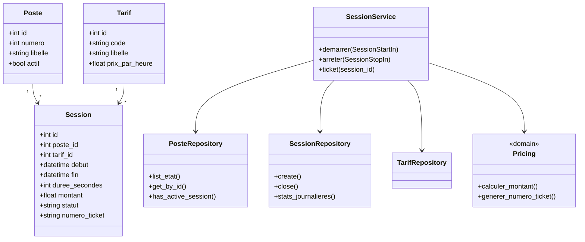
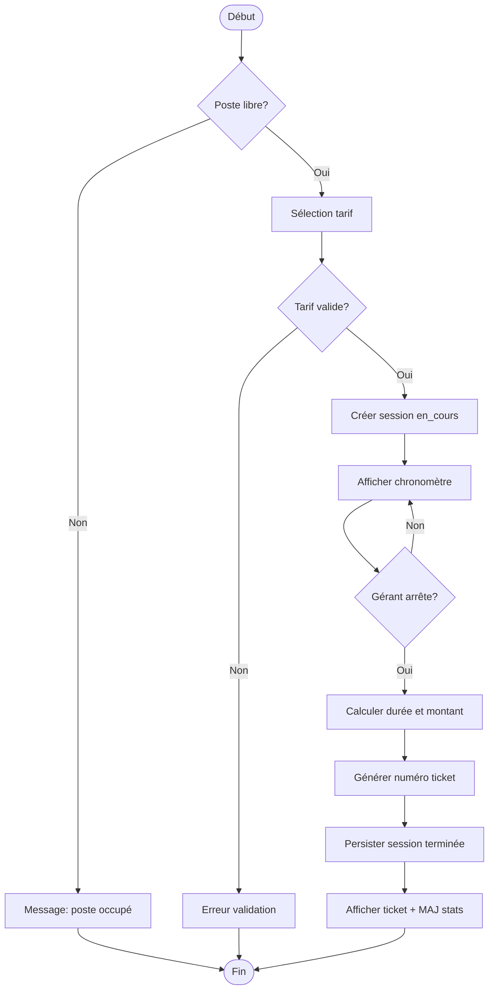

# Annexe B — Diagrammes UML

## B.1 Diagramme de cas d'utilisation

```mermaid
flowchart LR
    subgraph Acteurs
        G[Gérant]
        SYS[Système]
    end
    subgraph CyberCafé Manager
        UC1[Consulter tableau de bord]
        UC2[Démarrer session]
        UC3[Arrêter session]
        UC4[Consulter chronomètre]
        UC5[Générer ticket]
        UC6[Consulter statistiques journalières]
        UC7[Gérer tarifs]
        UC8[Configurer postes]
    end
    G --> UC1
    G --> UC2
    G --> UC3
    G --> UC4
    G --> UC5
    G --> UC6
    G --> UC7
    G --> UC8
    UC2 --> UC4
    UC3 --> UC5
    UC3 ..> UC2 : <<include>>
    UC5 ..> UC3 : <<include>>
    SYS --> UC4
```

**Acteur principal :** Gérant du cybercafé.  
**Acteur secondaire :** Système (chronomètre automatique).

---

## B.2 Diagramme de séquence — Démarrage de session



---

## B.3 Diagramme de séquence — Arrêt de session et ticket



---

## B.4 Diagramme de classes



**Relations :** Un poste accueille plusieurs sessions (dans le temps). Un tarif s'applique à plusieurs sessions. Les services orchestrent les repositories ; la logique de calcul est isolée dans `Pricing` (domaine).

---

## B.5 Diagramme d'activités — Flux de gestion d'une session


