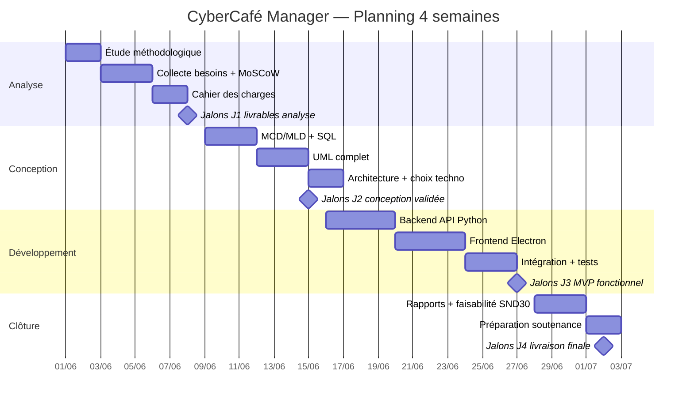

# Annexe C — Planning projet (4 semaines)

## C.1 Diagramme de Gantt

## C.2 Décomposition des tâches et charges

| ID | Tâche | Charge (h) | Responsable | Livrable |
|----|-------|------------|-------------|----------|
| T01 | Comparatif Cascade/Agile/Itérative | 8 | Étudiant | Section CDC §1 |
| T02 | Parties prenantes et besoins | 12 | Étudiant | Doc collecte besoins |
| T03 | Référentiel MoSCoW | 10 | Étudiant | Annexe A |
| T04 | Cahier des charges | 16 | Étudiant | PDF CDC |
| T05 | MCD/MLD + scripts SQL | 14 | Étudiant | schema.sql, seed.sql |
| T06 | Diagrammes UML | 12 | Étudiant | Annexe B |
| T07 | Architecture multicouche | 10 | Étudiant | Doc technique §5 |
| T08 | Backend FastAPI | 24 | Étudiant | Dossier backend/ |
| T09 | Frontend Electron | 20 | Étudiant | Dossier frontend/ |
| T10 | Tests et corrections | 12 | Étudiant | Jeu d'essais |
| T11 | Rapport technique | 18 | Étudiant | PDF rapport |
| T12 | Rapport faisabilité + SND30 | 10 | Étudiant | PDF faisabilité |
| T13 | Soutenance (slides) | 8 | Étudiant | PPTX |
| **Total** | | **174 h** | | |

## C.3 Chemin critique

**T01 → T02 → T03 → T05 → T08 → T09 → T10 → T11 → T13**

Toute retard sur la modélisation BDD (T05) ou le backend (T08) impacte directement l'intégration Electron et la rédaction finale. La conception UML (T06) peut partiellement chevaucher T05 si le MCD est validé en amont.

## C.4 Jalons

| Jalon | Date | Critère de succès |
|-------|------|-------------------|
| J1 | Semaine 1 | Besoins validés, MoSCoW signé, CDC v0.9 |
| J2 | Semaine 2 | MCD/MLD + UML + architecture approuvés |
| J3 | Semaine 3 | Démo live : session complète + ticket + stats |
| J4 | Semaine 4 | Dossier complet PDF + code GitHub + soutenance prête |
