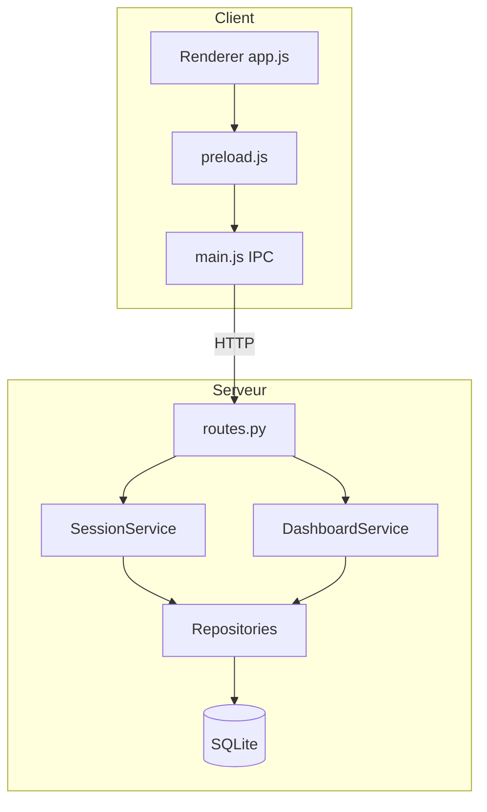

# DOCUMENTATION TECHNIQUE

## CyberCafé Manager — Système de gestion de cybercafé

---

| | |
|---|---|
| **Projet** | Services Numériques n°03 |
| **Version logicielle** | 1.0.0 |
| **Stack** | Electron + Python FastAPI + SQLite |
| **Classification** | Documentation d'exploitation et d'architecture |
| **Date** | Juin 2026 |

---

## Table des matières

1. [Introduction générale](#1-introduction-générale)
2. [Description détaillée du système](#2-description-détaillée-du-système)
3. [Modélisation des données](#3-modélisation-des-données)
4. [Architecture logicielle](#4-architecture-logicielle)
5. [Diagrammes UML](#5-diagrammes-uml)
6. [Choix techniques et patrons](#6-choix-techniques-et-patrons)
7. [Composants et interactions](#7-composants-et-interactions)
8. [API REST](#8-api-rest)
9. [Interface utilisateur](#9-interface-utilisateur)
10. [Sécurité et validation](#10-sécurité-et-validation)
11. [Installation et déploiement](#11-installation-et-déploiement)
12. [Annexes et références](#12-annexes-et-références)

---

## 1. Introduction générale

### 1.1 Objet de la documentation

La présente documentation technique décrit **comment le système est construit et exploité**. Elle s'adresse aux développeurs, mainteneurs et au jury technique. Elle complète le cahier des charges (le *quoi*) sans le remplacer.

### 1.2 Périmètre

- Architecture multicouche et schémas.
- Modèle de données relationnel (MCD/MLD).
- Spécification de l'API REST.
- Structure des dépôts `backend/`, `frontend/`, `database/`, `config/`.
- Principes POO, DRY, SOLID et validation des entrées.

### 1.3 Conventions

- Langage backend : Python 3.11
- Préfixe API : `/api/v1`
- Encodage : UTF-8
- Devise par défaut : XAF (Franc CFA)

---

## 2. Description détaillée du système

### 2.1 Vue d'ensemble

CyberCafé Manager automatise le cycle de vie d'une **session de connexion** sur un **poste** identifié, avec application d'un **tarif** horaire. Le gérant interagit uniquement avec l'interface Electron ; toute logique critique transite par l'API Python.

### 2.2 Flux métier principal

1. Le gérant consulte le tableau de bord (postes libres/occupés).
2. Sur un poste libre, il sélectionne un tarif et démarre une session.
3. Le système enregistre l'horodatage de début et affiche un chronomètre.
4. À l'arrêt, le système calcule durée × tarif, génère un ticket et met à jour les statistiques.

### 2.3 Modules logiciels

| Module | Responsabilité |
|--------|----------------|
| `frontend/` | Affichage, interactions, appels IPC → API |
| `backend/app/api/` | Routage HTTP, mapping erreurs |
| `backend/app/services/` | Règles métier et orchestration |
| `backend/app/repositories/` | Accès données SQLite |
| `backend/app/domain/` | Logique pure (tarification) |
| `database/` | Scripts DDL et seed |
| `config/tarifs.json` | Paramétrage métier exportable |

---

## 3. Modélisation des données

### 3.1 MCD (conceptuel)

**Entités :** POSTE, TARIF, SESSION.

**Associations :**
- POSTE (1,N) — SESSION : un poste accueille plusieurs sessions dans le temps.
- TARIF (1,N) — SESSION : un tarif s'applique à plusieurs sessions.

**Attributs clés :**
- SESSION : debut, fin, duree_secondes, montant, statut, numero_ticket.

### 3.2 MLD (relationnel, 3NF)

Tables : `postes`, `tarifs`, `sessions` (voir `database/schema.sql`).

**Normalisation :**
- 1NF : attributs atomiques.
- 2NF : pas de dépendance partielle (clés simples).
- 3NF : tarifs isolés de la session ; pas de transitivité poste → tarif hors session.

### 3.3 Vue matérialisée

`v_postes_etat` : jointure postes + session en cours + tarif pour alimenter le tableau de bord sans logique redondante côté client.

---

## 4. Architecture logicielle

### 4.1 Schéma multicouche

```
┌─────────────────────────────────────────┐
│  COUCHE PRÉSENTATION (Electron)         │
│  index.html, app.js, preload.js         │
└──────────────────┬──────────────────────┘
                   │ HTTP/JSON (localhost)
┌──────────────────▼──────────────────────┐
│  COUCHE API (FastAPI routes)            │
│  Validation Pydantic, CORS, erreurs     │
└──────────────────┬──────────────────────┘
                   │
┌──────────────────▼──────────────────────┐
│  COUCHE MÉTIER (Services)               │
│  SessionService, DashboardService       │
└──────────────────┬──────────────────────┘
                   │
┌──────────────────▼──────────────────────┐
│  COUCHE ACCÈS DONNÉES (Repositories)    │
└──────────────────┬──────────────────────┘
                   │
┌──────────────────▼──────────────────────┐
│  COUCHE PERSISTANCE (SQLite)              │
└─────────────────────────────────────────┘
```

### 4.2 Justification de la séparation Electron / Python

| Critère | Bénéfice |
|---------|----------|
| Testabilité | Tests API sans UI |
| POO | Classes services/repositories côté Python |
| Sécurité | `contextIsolation` + validation serveur |
| Évolutivité | Remplacement UI possible sans toucher au métier |

### 4.3 Comparatif architectural (rappel)

Voir cahier des charges §10 — architecture client-serveur local retenue vs monolithe et microservices.

---

## 5. Diagrammes UML

L'ensemble des diagrammes (cas d'utilisation, 2 séquences, classes, activités) est maintenu en **Annexe B** : `docs/annexes/diagrammes_uml.md` (format Mermaid, exportables en PNG via outils de rendu).

---

## 6. Choix techniques et patrons

### 6.1 Stack validée

| Couche | Technologie | Version cible |
|--------|-------------|---------------|
| UI | Electron | 33.x |
| Runtime UI | Chromium embarqué | — |
| API | FastAPI | 0.115.x |
| Serveur | Uvicorn | 0.34.x |
| Validation | Pydantic v2 | 2.10.x |
| BDD | SQLite | 3.x |

### 6.2 Patrons et principes

| Principe | Mise en œuvre |
|----------|---------------|
| **POO** | Classes `SessionService`, `PosteRepository`, etc. |
| **DRY** | `Pricing.calculer_montant` unique ; vue SQL `v_postes_etat` |
| **Modularité** | API découpée par domaines ; SQLite local |
| **Don't trust user input** | Pydantic sur tous les POST ; `Field(gt=0)` ; normalisation `tarif_code` ; IPC sans `nodeIntegration` |

### 6.3 Gestion des erreurs

Exceptions métier : `NotFoundError`, `ConflictError`, `ValidationError` → codes HTTP 404, 409, 400 avec corps JSON `{code, message}`.

---

## 7. Composants et interactions

### 7.1 Backend

```
backend/app/
├── main.py              # Point d'entrée FastAPI
├── config.py            # Settings (chemins BDD, tarifs)
├── database.py          # Connexion SQLite, init
├── schemas.py           # DTO Pydantic
├── exceptions.py
├── api/routes.py        # Endpoints
├── api/deps.py          # Injection connexion
├── services/
│   ├── session_service.py
│   └── dashboard_service.py
├── repositories/
│   ├── poste_repository.py
│   ├── session_repository.py
│   └── tarif_repository.py
└── domain/pricing.py
```

### 7.2 Frontend

```
frontend/
├── main.js       # Fenêtre + handlers IPC fetch API
├── preload.js    # Pont sécurisé window.cybercafe
└── renderer/
    ├── index.html
    ├── styles.css
    └── app.js
```

### 7.3 Diagramme de composants



---

## 8. API REST

| Méthode | Endpoint | Description |
|---------|----------|-------------|
| GET | `/api/v1/health` | Santé API |
| GET | `/api/v1/postes` | Tableau de bord |
| GET | `/api/v1/tarifs` | Liste tarifs actifs |
| GET | `/api/v1/stats/journalieres` | Stats du jour |
| POST | `/api/v1/sessions/start` | Body: `{poste_id, tarif_code}` |
| POST | `/api/v1/sessions/stop` | Body: `{session_id}` |
| GET | `/api/v1/sessions/{id}/ticket` | Ticket de caisse |

Documentation interactive : `http://127.0.0.1:8000/docs` (Swagger UI).

### 8.1 Formule tarifaire

```
montant = round((duree_secondes / 3600) * prix_par_heure, 0)
```

Implémentée dans `domain/pricing.py` — ne jamais recalculer uniquement côté client pour facturation finale.

---

## 9. Interface utilisateur

### 9.1 Principes UX

- Grille de cartes postes avec code couleur vert (libre) / orange (occupé).
- Chronomètre monospace par poste occupé.
- Panneau latéral : sélection tarif, ticket, messages d'erreur.
- Statistiques en en-tête (recettes XAF, nombre de sessions).

### 9.2 Adaptation contexte camerounais

- Textes en français.
- Devise XAF affichée avec séparateurs milliers.
- Thème sombre lisible en environnement lumineux variable.

### 9.3 Rafraîchissement

Polling 1,5 s sur le tableau de bord ; WebSocket prévu en évolution pour le temps réel multi-postes.

---

## 10. Sécurité et validation

| Menace | Mesure |
|--------|--------|
| Injection SQL | Requêtes paramétrées uniquement |
| Données invalides | Pydantic + contrôles `gt=0`, regex tarif |
| XSS | `escapeHtml` côté renderer ; CSP restrictive |
| Élévation Node | `nodeIntegration: false`, `contextIsolation: true` |
| Double session poste | Contrainte métier `has_active_session` |

---

## 11. Installation et déploiement

Voir `README.md` à la racine du dépôt.

**Ordre de démarrage obligatoire :**
1. Backend Uvicorn port 8000.
2. Electron `npm start`.

**Fichiers générés :** `data/cybercafe.db` (créé automatiquement).

**Sauvegarde recommandée :** copie périodique du dossier `data/`.

---

## 12. Annexes et références

| Annexe | Fichier |
|--------|---------|
| A — MoSCoW | `docs/annexes/referentiel_exigences_moscow.md` |
| B — UML | `docs/annexes/diagrammes_uml.md` |
| C — Gantt | `docs/annexes/planning_gantt.md` |
| D — Risques | `docs/annexes/analyse_risques.md` |
| E — Besoins | `docs/annexes/collecte_besoins.md` |
| F — SND30 | `docs/annexes/alignement_snd30.md` |

**Références techniques :** PEP 8, OpenAPI 3, SQLite documentation, Electron security guidelines.

---

*Fin de la documentation technique.*
